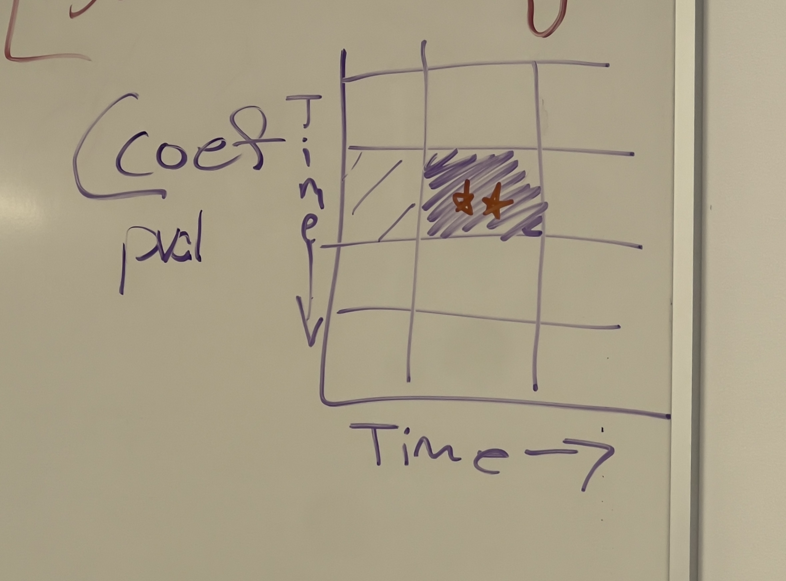

## Agenda
- review choice for sequencing depth
- review alpha diversity results
- review beta diversity results
- review taxonomy results
- review core microbiome results
- guidance for network analysis

## Notes
**Fig.1:**
- panel A = calf gg richness timepoints sex no overlap (no stats) 
  - p-value in table supplemental significance compare it to T1
- panel B = beta diversity pcoa based on sex
- panel C = beta diversity pcoa based on timepoint (acknowledge its the same plot as B coloured by diff metadata in the figure legend)
  - we need to see which timepoints to focus on so we did this. going forward T1, T5, and T8 was chosen for comparisons

- beta diversity pcoa: T1, T5, T8
  
  **OR**

- T1-T8 permanova adonis2: coloured based on coefficient of effect size ** R^2 value**, one for female and one for male
  - ignore residual and total

<ins>Adonis Plot Idea<ins>

**Fig.2:**

DESEq - Volcano plot OR Heat map

Talk to team 10 - have a lot of sig data DESEq. found a way to count how many are enriched and depleted.

**Fig.3:**

Panel A: weaning, Panel B: castration 

Core microbiome: 4-way analysis for T7 vs T8 for male and for female. 

no big diversity changes but minute taxa changes?

## Other Notes
- oral presentations:pick super relevants panels and not all panels.
- create a story thats easy to follow along
- create draft powerpoint

